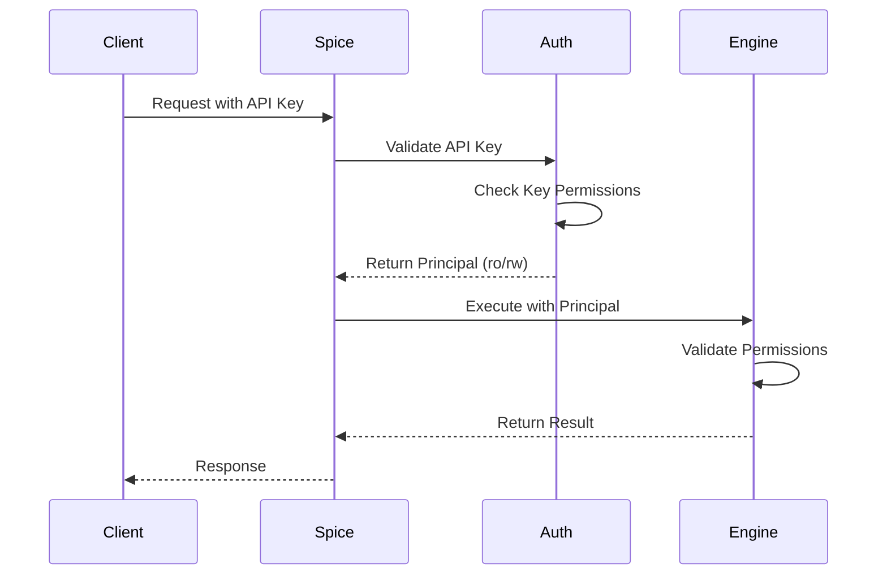

# Authorization and Access Control

Spice.ai implements role-based access control through API key permissions to manage what authenticated users can do with your data.

## Permission Levels

Spice supports two permission levels for API keys:

### Read-Only Access (`:ro`)

Read-only keys can:
- Execute `SELECT` queries
- Access search functions (`vector_search`, `text_search`)
- Query data through HTTP, Flight SQL, and gRPC APIs
- Access AI inference endpoints (OpenAI-compatible APIs)

Read-only keys **cannot**:
- Execute `INSERT`, `UPDATE`, `DELETE`, or `CREATE` statements
- Modify dataset accelerations
- Write to Iceberg tables
- Execute administrative operations

### Read-Write Access (`:rw`)

Read-write keys can:
- Perform all read-only operations
- Execute `INSERT INTO` statements to write data
- Create and modify temporary tables
- Write to Iceberg tables
- Execute data modification operations

## Configuring Permissions

### Basic Permission Configuration

Set permissions by appending `:ro` or `:rw` to API keys:

```yaml
runtime:
  auth:
    api_key:
      enabled: true
      keys:
        # Read-only keys for dashboards and analytics
        - ${secrets:DASHBOARD_KEY}:ro
        - ${secrets:ANALYTICS_KEY}:ro
        
        # Read-write keys for data ingestion
        - ${secrets:INGEST_KEY}:rw
        - ${secrets:ADMIN_KEY}:rw
```

### Multiple Keys with Different Permissions

You can configure multiple keys with different permission levels for different use cases:

```yaml
runtime:
  auth:
    api_key:
      enabled: true
      keys:
        # Public dashboard - read-only
        - ${secrets:PUBLIC_DASHBOARD_KEY}:ro
        
        # Internal analytics - read-only
        - ${secrets:INTERNAL_ANALYTICS_KEY}:ro
        
        # Data pipeline - read-write for ingestion
        - ${secrets:DATA_PIPELINE_KEY}:rw
        
        # Admin operations - read-write
        - ${secrets:ADMIN_KEY}:rw
```

## Authorization Flow

When a request is made to Spice:

1. **Authentication**: The API key is validated
2. **Principal Creation**: An authentication principal is created with associated permissions
3. **Authorization Check**: Before executing operations, Spice checks if the principal has required permissions
4. **Operation Execution**: If authorized, the operation proceeds



## Use Cases by Permission Level

### Read-Only Use Cases

<AccordionGroup>
  <Accordion title="Business Intelligence Dashboards">
    BI tools and dashboards only need to query data, not modify it:
    
    ```yaml
    keys:
      - ${secrets:TABLEAU_KEY}:ro
      - ${secrets:LOOKER_KEY}:ro
      - ${secrets:METABASE_KEY}:ro
    ```
  </Accordion>

  <Accordion title="Analytics and Reporting">
    Analytics pipelines that aggregate and analyze data:
    
    ```yaml
    keys:
      - ${secrets:ANALYTICS_ENGINE_KEY}:ro
      - ${secrets:REPORTING_SERVICE_KEY}:ro
    ```
  </Accordion>

  <Accordion title="AI/LLM Applications">
    RAG applications and AI agents querying data for context:
    
    ```yaml
    keys:
      - ${secrets:RAG_APPLICATION_KEY}:ro
      - ${secrets:AI_AGENT_KEY}:ro
    ```
  </Accordion>

  <Accordion title="Public APIs">
    Customer-facing APIs that expose read-only data:
    
    ```yaml
    keys:
      - ${secrets:PUBLIC_API_KEY}:ro
    ```
  </Accordion>
</AccordionGroup>

### Read-Write Use Cases

<AccordionGroup>
  <Accordion title="Data Ingestion Pipelines">
    ETL/ELT processes that load data into Spice:
    
    ```yaml
    keys:
      - ${secrets:AIRFLOW_KEY}:rw
      - ${secrets:KAFKA_CONNECTOR_KEY}:rw
      - ${secrets:FIVETRAN_KEY}:rw
    ```
  </Accordion>

  <Accordion title="Application Backends">
    Applications that both read and write data:
    
    ```yaml
    keys:
      - ${secrets:BACKEND_SERVICE_KEY}:rw
    ```
  </Accordion>

  <Accordion title="Administrative Operations">
    Admin tools and operations that need full access:
    
    ```yaml
    keys:
      - ${secrets:ADMIN_CONSOLE_KEY}:rw
      - ${secrets:DBA_KEY}:rw
    ```
  </Accordion>

  <Accordion title="Iceberg Table Writers">
    Services writing to Iceberg tables:
    
    ```yaml
    keys:
      - ${secrets:ICEBERG_WRITER_KEY}:rw
    ```
  </Accordion>
</AccordionGroup>

## Session-Based Authorization

For Flight SQL connections, Spice maintains session-based authorization:

1. Client authenticates with an API key during handshake
2. Runtime creates a session and associates it with the key's permissions
3. All operations within that session use the original key's permission level
4. Session tokens inherit the permissions of the API key used to create them

```python
# Example: Read-only session
client = flight.FlightClient("grpc://localhost:50051")
token = client.authenticate_basic_token(b"", b"readonly-key")

# This session can only execute SELECT queries
# INSERT/UPDATE/DELETE operations will fail
```

## Access Control Best Practices

### 1. Principle of Least Privilege

Grant the minimum permissions necessary:

```yaml
# Good: Separate keys with appropriate permissions
keys:
  - ${secrets:DASHBOARD_KEY}:ro     # Dashboard doesn't need write access
  - ${secrets:PIPELINE_KEY}:rw      # Pipeline needs to insert data

# Bad: Everything with read-write
keys:
  - ${secrets:DASHBOARD_KEY}:rw     # Over-privileged
  - ${secrets:PIPELINE_KEY}:rw
```

### 2. Segregate by Environment

Use different keys for different environments:

```yaml
# Development
runtime:
  auth:
    api_key:
      keys:
        - ${secrets:DEV_KEY}:rw

# Production
runtime:
  auth:
    api_key:
      keys:
        - ${secrets:PROD_READ_KEY}:ro
        - ${secrets:PROD_WRITE_KEY}:rw
```

### 3. Audit Access Patterns

Monitor API key usage to ensure appropriate access:

```bash
# Review logs for authorization failures
grep "Authorization failed" /var/log/spice/spiced.log

# Monitor which keys are being used
grep "Authentication successful" /var/log/spice/spiced.log | \
  awk '{print $NF}' | sort | uniq -c
```

### 4. Regular Permission Review

Periodically review and audit key permissions:

- Remove unused keys
- Downgrade over-privileged keys to read-only
- Ensure new services use appropriate permission levels
- Rotate keys that may have been compromised

### 5. Combine with Network Security

Layer authorization with network-level controls:

```yaml
# Example: Kubernetes NetworkPolicy
apiVersion: networking.k8s.io/v1
kind: NetworkPolicy
metadata:
  name: spice-access-policy
spec:
  podSelector:
    matchLabels:
      app: spice
  ingress:
  - from:
    - namespaceSelector:
        matchLabels:
          name: trusted-apps
    ports:
    - protocol: TCP
      port: 3000
    - protocol: TCP
      port: 50051
```

## Handling Authorization Errors

When a read-only key attempts a write operation:

```bash
# HTTP Response
HTTP/1.1 403 Forbidden
Content-Type: application/json

{
  "error": "Permission denied: Write operations require read-write access"
}
```

```python
# Flight SQL
try:
    client.do_put(descriptor, batch_reader)
except flight.FlightUnauthorizedError as e:
    print(f"Authorization failed: {e}")
```

## Advanced Authorization Patterns

### Dataset-Level Access Control

While Spice's API key permissions are runtime-wide, you can implement dataset-level access control by:

1. Running multiple Spice instances with different datasets
2. Using different API keys for each instance
3. Routing requests based on required dataset access

```yaml
# Instance 1: Public data (read-only access)
kind: Spicepod
name: public-data
datasets:
  - from: s3://public-bucket/data
    name: public_dataset

runtime:
  auth:
    api_key:
      keys:
        - ${secrets:PUBLIC_KEY}:ro

---
# Instance 2: Internal data (read-write for authorized users)
kind: Spicepod
name: internal-data
datasets:
  - from: postgres:internal_db
    name: sensitive_data

runtime:
  auth:
    api_key:
      keys:
        - ${secrets:INTERNAL_KEY}:rw
```

### Time-Based Access

Implement time-based access by rotating keys programmatically:

```bash
#!/bin/bash
# Rotate keys daily

# Generate new key
NEW_KEY=$(openssl rand -hex 32)

# Update secret store
kubectl create secret generic spice-api-keys \
  --from-literal=daily-key="${NEW_KEY}:ro" \
  --dry-run=client -o yaml | kubectl apply -f -

# Restart Spice to pick up new key
kubectl rollout restart deployment/spice
```

## Related Resources

- [Authentication](/advanced/authentication)
- [Secrets Management](/advanced/secrets)
- [TLS Configuration](/advanced/tls)
- [Security Best Practices](https://spiceai.org/docs/security)