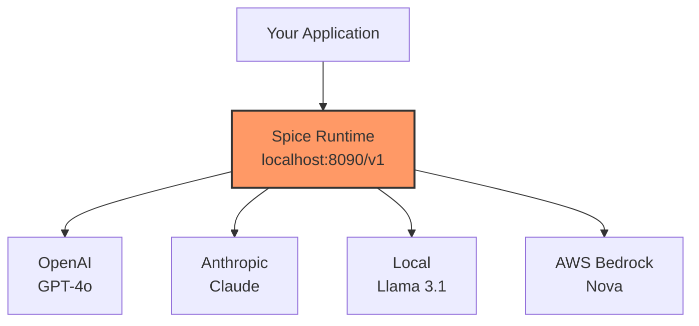
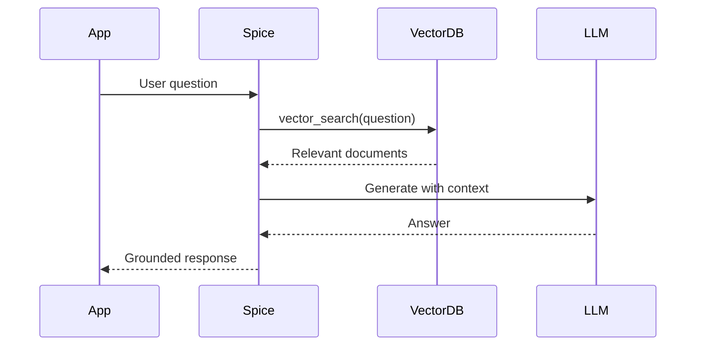

## Overview

Spice is an **AI-native runtime** that combines data query and AI inference in a single engine. This unified approach enables:

- **Data-grounded AI**: LLMs powered by real-time, accurate data
- **Retrieval-Augmented Generation (RAG)**: Search + LLM in one system
- **AI feedback loops**: Co-locate data and models for iterative learning
- **OpenAI-compatible APIs**: Drop-in replacement for OpenAI SDK

## OpenAI-Compatible APIs

Spice provides HTTP APIs compatible with the OpenAI SDK:

### Chat Completions

```bash
curl http://localhost:8090/v1/chat/completions \
  -H "Content-Type: application/json" \
  -d '{
    "model": "llama-3.1-8b-instruct",
    "messages": [
      {"role": "system", "content": "You are a helpful assistant."},
      {"role": "user", "content": "What is the capital of France?"}
    ],
    "temperature": 0.7
  }'
```

**Using OpenAI Python SDK:**

```python
from openai import OpenAI

client = OpenAI(
    base_url="http://localhost:8090/v1",
    api_key="not-needed"  # No key required for local models
)

response = client.chat.completions.create(
    model="llama-3.1-8b-instruct",
    messages=[
        {"role": "system", "content": "You are a data analyst."},
        {"role": "user", "content": "Summarize this data: ..."}
    ]
)

print(response.choices[0].message.content)
```

### Embeddings API

```bash
curl http://localhost:8090/v1/embeddings \
  -H "Content-Type: application/json" \
  -d '{
    "model": "text-embedding-3-small",
    "input": "The quick brown fox jumps over the lazy dog"
  }'
```

**Using OpenAI SDK:**

```python
embeddings = client.embeddings.create(
    model="text-embedding-3-small",
    input="Your text here"
)

vector = embeddings.data[0].embedding
print(f"Embedding dimension: {len(vector)}")
```

### Model Listing

```bash
curl http://localhost:8090/v1/models
```

Lists all available models (local and hosted).

## Model Providers

Spice supports multiple model sources:

### OpenAI (Hosted)

```yaml spicepod.yaml
models:
  - from: openai
    name: gpt-4o
    params:
      openai_api_key: ${secrets:openai_key}
```

**Available models:**

- `gpt-4o`: Most capable, multimodal
- `gpt-4o-mini`: Cost-effective, fast
- `gpt-3.5-turbo`: Legacy, low cost
- `o1-preview`, `o1-mini`: Reasoning models

### Anthropic (Hosted)

```yaml
models:
  - from: anthropic
    name: claude-3-5-sonnet-20241022
    params:
      anthropic_api_key: ${secrets:anthropic_key}
```

**Available models:**

- `claude-3-5-sonnet-20241022`: Latest, most capable
- `claude-3-5-haiku-20241022`: Fast, cost-effective
- `claude-3-opus-20240229`: Previous flagship

### xAI (Hosted)

```yaml
models:
  - from: xai
    name: grok-beta
    params:
      xai_api_key: ${secrets:xai_key}
```

### AWS Bedrock (Hosted)

```yaml
models:
  - from: bedrock
    name: amazon.nova-pro-v1:0
    params:
      aws_region: us-east-1
      aws_access_key_id: ${secrets:aws_key}
      aws_secret_access_key: ${secrets:aws_secret}
```

**Available models:**

- `amazon.nova-pro-v1:0`: Nova Pro
- `amazon.nova-lite-v1:0`: Nova Lite
- `anthropic.claude-*`: Claude via Bedrock
- `meta.llama3-*`: Llama via Bedrock

### Azure OpenAI

```yaml
models:
  - from: azure
    name: gpt-4o
    params:
      azure_openai_endpoint: https://your-resource.openai.azure.com
      azure_openai_api_key: ${secrets:azure_key}
      azure_openai_deployment_id: gpt-4o-deployment
```

### Local Models (File)

Run models locally with **CUDA or Metal acceleration**:

```yaml
models:
  - from: file
    name: llama-3.1-8b-instruct
    files:
      - path: /models/llama-3.1-8b-instruct-q4.gguf
    params:
      llm_context_length: 8192
      llm_n_gpu_layers: 35  # GPU offload
```

**Supported formats:**

- **GGUF**: Quantized models (most common)
- **GGML**: Legacy quantized format
- **SafeTensor**: Full precision weights

**Quantization levels:**

- `Q2`: 2-bit (smallest, lowest quality)
- `Q4_K_M`: 4-bit medium (recommended balance)
- `Q5_K_M`: 5-bit medium
- `Q8_0`: 8-bit (near full quality)
- `F16`: Full 16-bit precision

**Hardware acceleration:**

```yaml
params:
  llm_n_gpu_layers: 35      # CUDA (NVIDIA)
  # OR
  llm_metal_enabled: true   # Metal (Apple Silicon)
```

### HuggingFace Models

Download and run HuggingFace models:

```yaml
models:
  - from: huggingface
    name: meta-llama/Llama-3.1-8B-Instruct
    params:
      huggingface_token: ${secrets:hf_token}  # For gated models
      llm_n_gpu_layers: 35
```

Spice downloads models automatically on first use.

### Spice.ai Cloud Platform

```yaml
models:
  - from: spice.ai
    name: gpt-4o
    params:
      spiceai_api_key: ${secrets:spice_key}
```

Hosted models on Spice Cloud Platform.

## AI Gateway

Spice acts as an **AI gateway** for multiple model providers:



**Benefits:**

- Single endpoint for all models
- Unified observability and logging
- Cost tracking across providers
- Fallback routing
- Local development without API keys

## Retrieval-Augmented Generation (RAG)

Combine search and LLM inference:



### RAG Implementation

**1. Embed your knowledge base:**

```yaml spicepod.yaml
datasets:
  - from: postgres:public.knowledge_base
    name: kb_articles
    acceleration:
      enabled: true
    columns:
      - name: content
        embeddings:
          - from: openai
            model: text-embedding-3-small
            row_ids:
              - article_id
    vectors:
      store: s3_vectors
```

**2. Query for context:**

```python
from openai import OpenAI
import duckdb

client = OpenAI(base_url="http://localhost:8090/v1", api_key="not-needed")

# Get relevant context
con = duckdb.connect("http://localhost:8090")
context_docs = con.execute("""
    SELECT content, _score 
    FROM vector_search(kb_articles, 'How do I reset my password?', 5)
    ORDER BY _score DESC
""").fetchall()

# Build context string
context = "\n\n".join([doc[0] for doc in context_docs])

# Generate with context
response = client.chat.completions.create(
    model="gpt-4o",
    messages=[
        {"role": "system", "content": f"Answer based on this context:\n{context}"},
        {"role": "user", "content": "How do I reset my password?"}
    ]
)

print(response.choices[0].message.content)
```

**3. SQL-integrated RAG:**

```sql
-- Get context in a single query
WITH context AS (
    SELECT content FROM vector_search(
        kb_articles, 
        'How do I reset my password?', 
        5
    )
)
SELECT 
    string_agg(content, '\n\n') as context_text
FROM context;
```

See [Search](/concepts/search) for vector search details.

## Text-to-SQL (NSQL)

Convert natural language to SQL queries:

```python
from openai import OpenAI

client = OpenAI(base_url="http://localhost:8090/v1", api_key="not-needed")

# Get table schema
schema = """
table: orders
columns: order_id (int), customer_id (int), order_date (date), total (decimal)

table: customers  
columns: customer_id (int), name (text), email (text)
"""

# Generate SQL from natural language
response = client.chat.completions.create(
    model="gpt-4o",
    messages=[
        {"role": "system", "content": f"Generate SQL for this schema:\n{schema}"},
        {"role": "user", "content": "Show me total sales by customer in the last 30 days"}
    ]
)

generated_sql = response.choices[0].message.content
print(generated_sql)
# Output: SELECT c.name, SUM(o.total) as total_sales FROM orders o JOIN customers c ...
```

## LLM Memory

Store conversation history in Spice:

```yaml spicepod.yaml
datasets:
  - from: sqlite:memory.db:conversations
    name: chat_history
    acceleration:
      enabled: true
      engine: sqlite
      mode: file
```

**Store messages:**

```python
import duckdb

con = duckdb.connect("http://localhost:8090")

con.execute("""
    INSERT INTO chat_history (session_id, role, content, timestamp)
    VALUES (?, ?, ?, CURRENT_TIMESTAMP)
""", [session_id, "user", user_message])

con.execute("""
    INSERT INTO chat_history (session_id, role, content, timestamp)
    VALUES (?, ?, ?, CURRENT_TIMESTAMP)
""", [session_id, "assistant", assistant_response])
```

**Retrieve history:**

```python
history = con.execute("""
    SELECT role, content 
    FROM chat_history 
    WHERE session_id = ?
    ORDER BY timestamp
    LIMIT 10
""", [session_id]).fetchall()

messages = [{"role": row[0], "content": row[1]} for row in history]
```

## Model Context Protocol (MCP)

Integrate with external tools via MCP (HTTP + SSE):

```yaml spicepod.yaml
tools:
  - from: mcp
    name: weather_api
    params:
      mcp_endpoint: http://weather-service:8080/mcp
```

**Function calling:**

```python
response = client.chat.completions.create(
    model="gpt-4o",
    messages=[{"role": "user", "content": "What's the weather in Paris?"}],
    tools=[{
        "type": "function",
        "function": {
            "name": "get_weather",
            "description": "Get current weather",
            "parameters": {
                "type": "object",
                "properties": {
                    "location": {"type": "string"}
                },
                "required": ["location"]
            }
        }
    }]
)

if response.choices[0].message.tool_calls:
    # Execute tool call
    tool_call = response.choices[0].message.tool_calls[0]
    # Call weather API with tool_call.function.arguments
```

## Observability & Monitoring

Spice provides deep visibility into AI workflows:

### Query Metrics

```sql
-- LLM query history
SELECT 
    query_id,
    model,
    input_tokens,
    output_tokens,
    duration_ms,
    cost_usd
FROM runtime.llm_queries
ORDER BY timestamp DESC
LIMIT 10;
```

### Token Usage

```sql
-- Aggregate token usage by model
SELECT 
    model,
    SUM(input_tokens) as total_input,
    SUM(output_tokens) as total_output,
    SUM(cost_usd) as total_cost
FROM runtime.llm_queries
GROUP BY model;
```

### Tracing

OpenTelemetry-compatible tracing for end-to-end request tracking:

```yaml spicepod.yaml
runtime:
  telemetry:
    enabled: true
    endpoint: http://jaeger:4318
```

Traces include:

- Vector search latency
- Embedding generation time
- LLM inference duration
- Data retrieval timing

## Evaluations (Evals)

Assess model and data quality:

```yaml spicepod.yaml
evals:
  - name: qa_accuracy
    from: dataset:qa_test_set
    type: llm_graded
    params:
      judge_model: gpt-4o
      criteria: accuracy
```

**Run evaluation:**

```bash
spice eval run qa_accuracy
```

See [Evaluations](/features/evaluations) for detailed guide.

## Embeddings

Generate embeddings for vector search:

```yaml
embeddings:
  - from: openai
    name: text-embedding-3-small
    params:
      openai_api_key: ${secrets:openai_key}
```

**Supported providers:**

| Provider | Models | Status |
|----------|--------|--------|
| `openai` | text-embedding-3-small, text-embedding-3-large | Release Candidate |
| `bedrock` | amazon.titan-embed-text-v1, cohere.embed-english-v3 | Alpha |
| `huggingface` | sentence-transformers/* | Release Candidate |
| `model2vec` | minishlab/M2V_base_output (500x faster) | Release Candidate |
| `file` | Local ONNX models | Release Candidate |
| `azure` | Azure OpenAI embeddings | Alpha |

See [Search](/concepts/search) for embedding usage.

## AI Use Cases

### 1. Customer Support Bot


### 2. Data Analysis Agent

```python
# Natural language to insights
question = "Which products had declining sales last quarter?"

# Text-to-SQL
sql = generate_sql(question)  # Using LLM

# Execute
results = con.execute(sql).fetchdf()

# Summarize with LLM
summary = client.chat.completions.create(
    model="gpt-4o",
    messages=[
        {"role": "system", "content": "Summarize this data analysis"},
        {"role": "user", "content": f"Data:\n{results.to_string()}\n\nQuestion: {question}"}
    ]
)

print(summary.choices[0].message.content)
```

### 3. Semantic Search Engine

```sql
-- Hybrid search: semantic + keyword + filters
WITH semantic AS (
    SELECT doc_id, _score FROM vector_search(docs, 'machine learning', 20)
),
keyword AS (
    SELECT doc_id, _score FROM text_search(docs, 'ML AI neural', 20)
)
SELECT 
    d.*,
    COALESCE(s._score, 0) + COALESCE(k._score, 0) as relevance
FROM docs d
LEFT JOIN semantic s ON d.doc_id = s.doc_id
LEFT JOIN keyword k ON d.doc_id = k.doc_id
WHERE (s.doc_id IS NOT NULL OR k.doc_id IS NOT NULL)
  AND d.published_date >= CURRENT_DATE - INTERVAL '1 year'
ORDER BY relevance DESC;
```

## Best Practices

1. **Use appropriate models**: Balance cost, speed, and quality
2. **Implement RAG**: Ground LLMs in your data for accuracy
3. **Monitor token usage**: Track costs across providers
4. **Cache embeddings**: Reuse vector representations
5. **Use local models for development**: Avoid API costs during testing
6. **Enable GPU acceleration**: For local model inference
7. **Implement evals**: Continuously assess quality
8. **Store conversation history**: Enable context-aware responses
9. **Use hybrid search**: Combine semantic and keyword search
10. **Trace requests**: Use OpenTelemetry for debugging

## Next Steps

<CardGroup cols={2}>
  <Card title="Search" icon="magnifying-glass" href="/concepts/search">
    Vector and full-text search for RAG
  </Card>
  <Card title="Models" icon="cube" href="/components/models">
    Configure LLM and embedding models
  </Card>
  <Card title="Embeddings" icon="vector-square" href="/components/embeddings">
    Embedding provider setup
  </Card>
  <Card title="OpenAI Cookbook" icon="book" href="https://github.com/spiceai/cookbook/tree/trunk/openai_sdk">
    OpenAI SDK integration examples
  </Card>
</CardGroup>