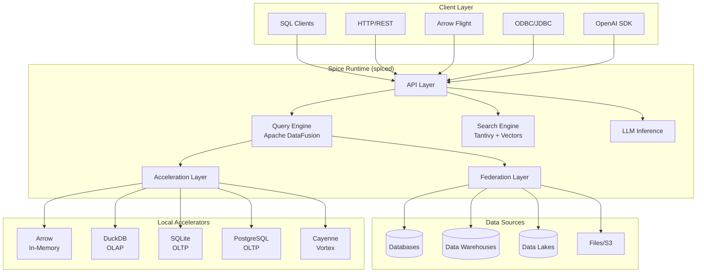
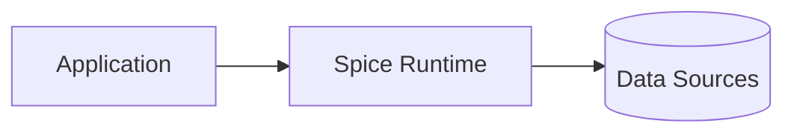
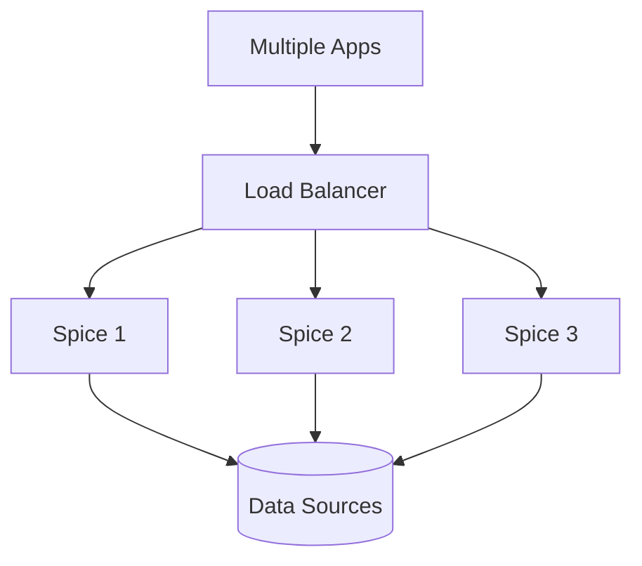
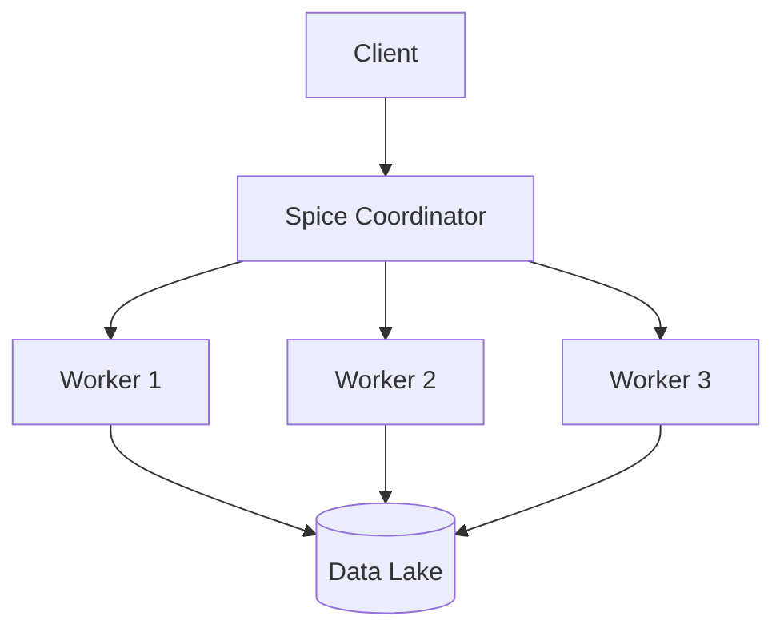
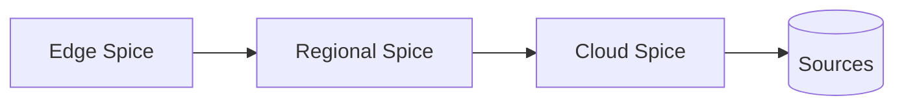
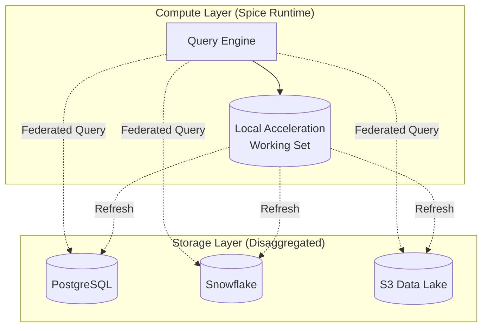

## Overview

Spice is a SQL query, search, and LLM-inference engine written in Rust for data apps and agents. It provides a lightweight, portable runtime (single binary/container) that combines data query and AI inference in a unified engine.

## System Architecture

## Core Components

### Runtime Daemon (spiced)

The Spice runtime is a long-running daemon process that:

- Manages data connections and accelerations
- Executes SQL queries via Apache DataFusion
- Serves multiple API endpoints (HTTP, Arrow Flight, ODBC, JDBC)
- Performs AI/LLM inference with OpenAI-compatible APIs
- Provides search capabilities (vector, keyword, full-text)

### CLI (spice)

The command-line interface for:

- Initializing Spicepods (`spice init`)
- Managing the runtime (`spice run`)
- Querying data (`spice sql`)
- Configuring datasets and models

## Industry-Standard APIs

Spice provides four primary API surfaces:

### 1. SQL Query & Search APIs

- **HTTP/REST**: JSON query endpoint
- **Arrow Flight**: High-performance binary protocol
- **Arrow Flight SQL**: SQL over Arrow Flight
- **ODBC/JDBC/ADBC**: Standard database connectivity
- **UDTFs**: `vector_search()` and `text_search()` table functions

### 2. OpenAI-Compatible APIs

- Chat completions endpoint (`/v1/chat/completions`)
- Embeddings endpoint (`/v1/embeddings`)
- Model listing (`/v1/models`)
- Compatible with OpenAI SDK

### 3. Iceberg Catalog REST API

Unified catalog interface for:

- Table metadata
- Schema evolution
- Time travel queries

### 4. MCP (Model Context Protocol)

HTTP + Server-Sent Events (SSE) integration for:

- Tool/function calling
- External integrations
- Agent workflows

## Design Principles

### 1. Data Correctness is Non-Negotiable

**As an AI-native database and search engine, data correctness is the foundational principle.** Every query must return correct results. Incorrect data is unacceptable under any circumstances.

- Correctness supersedes performance, developer experience, and feature velocity
- Slow correct answers are infinitely better than fast wrong ones
- NULL handling, type coercions, and boundary conditions must be precise
- Errors are surfaced visibly rather than silently corrupting data

### 2. Secure by Default

Spice defaults to secure configurations:

- TLS/SSL encrypted connections to remote sources
- Optional insecure mode when needed
- No credentials stored in plain text

### 3. Developer Experience First

The goal is to make creating intelligent applications as easy as possible:

- Simple YAML configuration (Spicepod)
- Single binary deployment
- Standard SQL interface
- Extensive connector ecosystem

### 4. Bring Data and AI to Your Application

Instead of sending data to another service:

- Co-locate data with applications
- Run at the application level (1:1 or 1:N mapping)
- Deploy as sidecar, microservice, or cluster
- Enable AI feedback loops locally

### 5. API First

All functionality is available through HTTP APIs on the runtime.

### 6. Composable from Community Components

Spice projects consist of:

- Datasets from various sources
- Models from HuggingFace, OpenAI, local files
- Community-built components via Spicerack registry

### 7. Extensibility First-Class

All components use well-defined interfaces:

- Data Connectors
- Data Accelerators
- Catalog Connectors
- Secret Stores
- Models and Embeddings

See [Extensibility](/concepts/extensibility) for details.

## Application-Focused Deployment

### Traditional Databases vs. Spice

| Traditional Databases | Spice |
|-----------------------|-------|
| Many apps → One database | One app → One Spice instance |
| Centralized, shared | Distributed, app-level |
| Shared schema | App-specific schema |
| Network latency | Local/co-located |

### Deployment Patterns

**Sidecar Pattern** (Common)

Each application runs its own Spice instance for:

- Zero network latency
- Isolated acceleration
- Independent scaling
- Per-tenant deployments

**Microservice Pattern**

**Cluster Pattern** (Distributed Query)

Scale query execution across multiple nodes using Apache Ballista.

**Tiered/Chained Pattern**

Deploy across edge, on-prem, and cloud for tier-optimized workloads.

## Technology Stack

Spice is built on industry-leading open-source technologies:

- **Apache DataFusion**: Query planning and execution engine
- **Apache Arrow**: Columnar memory format and compute kernels
- **Arrow Flight**: High-performance data transport
- **DuckDB**: Embedded OLAP engine for acceleration
- **SQLite**: Embedded OLTP engine for acceleration
- **Vortex**: Compressed columnar format (Cayenne accelerator)
- **Tantivy**: Full-text search engine (Rust)
- **Rust**: Systems programming language for performance and safety

## Disaggregated Storage Architecture

Spice separates compute from storage:

### Key Benefits

1. **Co-locate working sets** with applications for low latency
2. **Access source data** in original storage without migration
3. **Independent scaling** of compute and storage
4. **Fast cold starts** via acceleration snapshots from S3
5. **Ephemeral compute** with persistent recovery

## Separate Tokio Runtimes

Spice uses isolated async runtimes for different concerns:

- **HTTP Server Runtime**: Health checks, API endpoints (must stay responsive)
- **Query Processing Runtime**: DataFusion planning and execution (CPU/IO intensive)

**Why?** DataFusion uses one thread pool for all operations. Large queries can block HTTP endpoints, causing Kubernetes health check failures. Separate runtimes ensure HTTP responsiveness regardless of query load.

## Next Steps

<CardGroup cols={2}>
  <Card title="Data Federation" icon="network-wired" href="/concepts/data-federation">
    Query across databases, warehouses, and lakes
  </Card>
  <Card title="Data Acceleration" icon="gauge-high" href="/concepts/data-acceleration">
    Materialize and cache data locally
  </Card>
  <Card title="Search" icon="magnifying-glass" href="/concepts/search">
    Vector, keyword, and full-text search
  </Card>
  <Card title="AI Inference" icon="brain" href="/concepts/ai-inference">
    LLM inference and embeddings
  </Card>
</CardGroup>