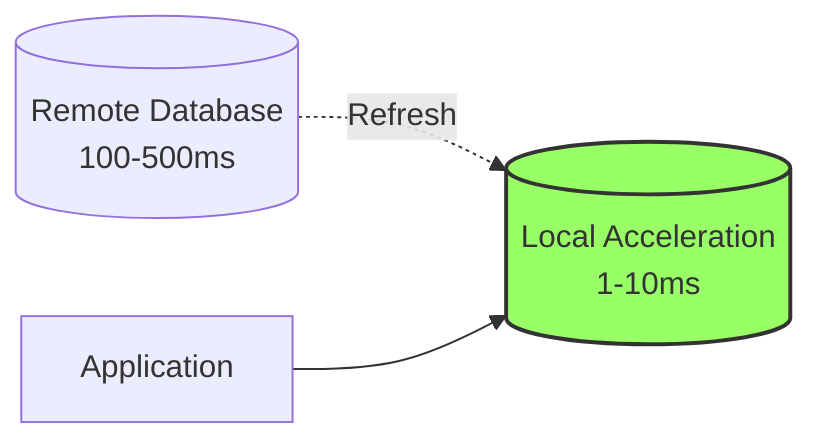
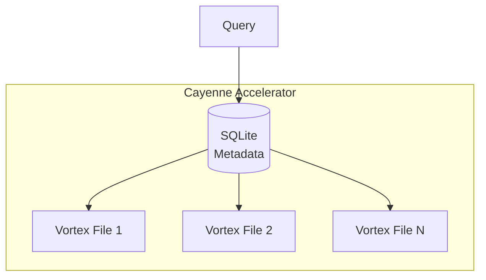
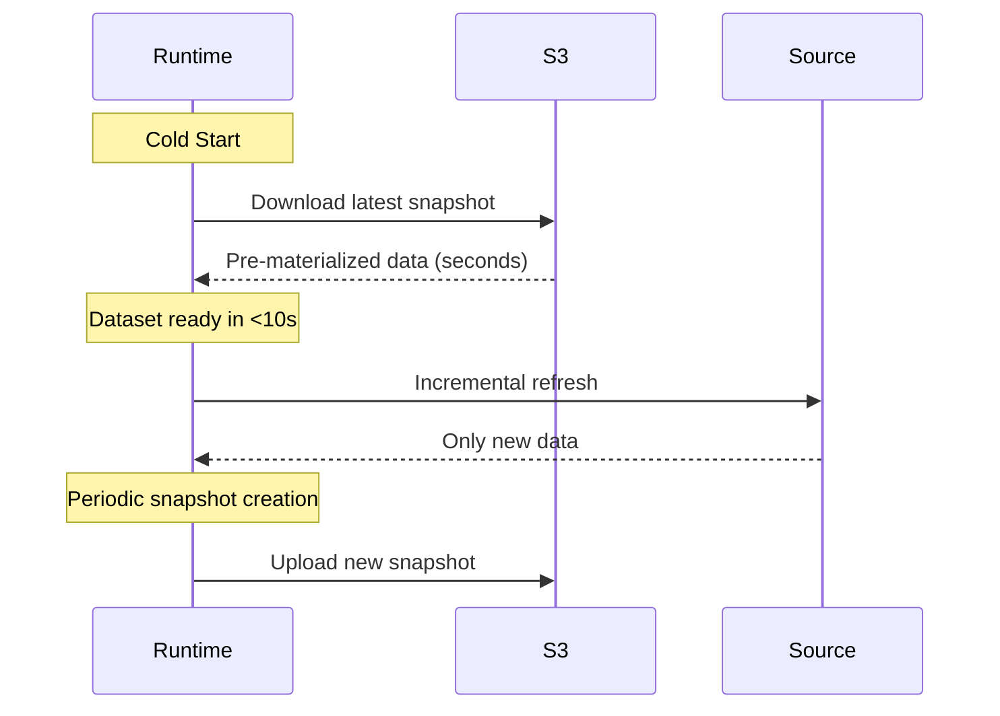

## What is Data Acceleration?

Data acceleration materializes data from remote sources into local storage for fast, low-latency queries. Think of it as an active cache or CDN for databases that prefetches and stores working sets of data close to your application.



**Key Difference from Caching:**

- **Traditional Cache**: Fetches data on cache-miss (reactive)
- **Spice Acceleration**: Prefetches and materializes data on schedule/trigger/CDC (proactive)

## Dual-Engine Acceleration

Spice supports both **OLAP** (analytical) and **OLTP** (transactional) acceleration engines at the dataset level:

| Engine | Mode | Type | Best For |
|--------|------|------|----------|
| `arrow` | `memory` | OLAP | Fast analytical queries, large scans |
| `duckdb` | `memory`, `file` | OLAP | Complex analytics, aggregations, joins |
| `cayenne` | `file` | OLAP | High compression, S3-backed, multi-file scale |
| `sqlite` | `memory`, `file` | OLTP | Point queries, indexes, ACID transactions |
| `postgres` | N/A | OLTP | Shared acceleration, remote OLTP access |

### OLAP vs OLTP Engines

**OLAP (Analytical)** - Optimized for:

- Large table scans
- Aggregations (SUM, AVG, GROUP BY)
- Complex joins
- Columnar storage
- Compression

**OLTP (Transactional)** - Optimized for:

- Point queries (single row lookups)
- Index-based retrieval
- ACID transactions
- Row-based storage
- Concurrent updates

**Choose based on access pattern:**

```yaml
# OLAP workload - analytics dashboard
- from: postgres:public.sales
  name: sales_analytics
  acceleration:
    enabled: true
    engine: duckdb  # Fast aggregations
    mode: memory

# OLTP workload - user profile lookups
- from: postgres:public.users
  name: user_profiles
  acceleration:
    enabled: true
    engine: sqlite  # Fast indexed lookups
    mode: memory
```

## Acceleration Engines

### Arrow (In-Memory)

**Best for:** Fast analytical queries on datasets that fit in memory

```yaml
acceleration:
  enabled: true
  engine: arrow
  mode: memory
  refresh_check_interval: 10s
```

**Characteristics:**

- Zero-copy reads
- Columnar format
- SIMD-optimized compute
- No persistence (ephemeral)

### DuckDB (OLAP)

**Best for:** Complex analytical queries with aggregations and joins

```yaml
acceleration:
  enabled: true
  engine: duckdb
  mode: file  # or 'memory'
  refresh_check_interval: 1h
```

**Modes:**

- `memory`: In-memory database (fast, ephemeral)
- `file`: Persistent to disk (survives restarts)

**Characteristics:**

- Excellent for GROUP BY, JOIN, aggregations
- Compressed columnar storage
- ACID transactions
- Can query Parquet directly

### Cayenne (Vortex + SQLite)

**Best for:** High compression, multi-file scaling, S3-backed acceleration

```yaml
acceleration:
  enabled: true
  engine: cayenne
  mode: file
  refresh_check_interval: 1d
```

**Architecture:**



**Characteristics:**

- DuckDB-comparable performance
- No single-file size limits
- Compressed columnar format (Vortex)
- Primary key support for upserts/deletes
- CRUD operations
- File-mode only

**Limitations:**

- File mode only (no memory mode)
- No secondary indexes
- No snapshots support
- Some Arrow types unsupported (Interval, Duration, Map)

### SQLite (OLTP)

**Best for:** Point queries, indexed lookups, small to medium datasets

```yaml
acceleration:
  enabled: true
  engine: sqlite
  mode: file  # or 'memory'
  indexes:
    user_id: enabled
    email: unique
  refresh_check_interval: 5m
```

**Modes:**

- `memory`: In-memory (fast, ephemeral)
- `file`: Persistent to disk

**Characteristics:**

- Fast indexed queries
- ACID transactions
- Row-based storage
- Supports indexes and unique constraints

### PostgreSQL (OLTP)

**Best for:** Shared acceleration across multiple Spice instances, remote OLTP

```yaml
acceleration:
  enabled: true
  engine: postgres
  params:
    pg_host: acceleration-db.internal
    pg_port: 5432
    pg_db: spice_accel
    pg_user: ${secrets:accel_user}
    pg_pass: ${secrets:accel_pass}
```

**Characteristics:**

- Shared across Spice instances
- Full PostgreSQL feature set
- Network latency vs. embedded engines
- Concurrent writes from multiple runtimes

## Acceleration Modes

### Memory Mode

Data stored in RAM (ephemeral):

```yaml
acceleration:
  enabled: true
  mode: memory
```

**Pros:**

- Fastest query performance
- Zero disk I/O

**Cons:**

- Lost on restart
- Limited by available RAM
- Cold start requires full refresh

**Use when:** Data can be reloaded quickly, high-performance queries required

### File Mode

Data persisted to disk:

```yaml
acceleration:
  enabled: true
  mode: file
```

**Pros:**

- Survives restarts
- Larger datasets (disk-bound)
- Fast cold starts (no initial load)

**Cons:**

- Slower than memory (disk I/O)

**Use when:** Data takes time to reload, persistence required

### File Create Mode

Always start fresh (truncate on startup):

```yaml
acceleration:
  enabled: true
  mode: file_create
```

**Use when:** You want a fresh acceleration on every restart

## Refresh Strategies

### Full Refresh

Replace entire dataset:

```yaml
acceleration:
  enabled: true
  refresh_mode: full
  refresh_check_interval: 1h
```

**Best for:** Small datasets, complete data replacement needed

### Append Refresh

Add only new data:

```yaml
acceleration:
  enabled: true
  refresh_mode: append
  refresh_check_interval: 5m
  refresh_append_overlap: 1m  # Overlap to catch late arrivals
  time_column: created_at
  time_format: timestamp
```

**Best for:** Time-series data, append-only logs

**Example from spicepod.yml:**

```yaml
- from: github:github.com/spiceai/spiceai/stargazers
  name: stargazers
  time_column: starred_at
  time_format: timestamp
  acceleration:
    enabled: true
    engine: duckdb
    refresh_mode: append
    refresh_append_overlap: 5m
    refresh_check_interval: 1h
```

### Changes Refresh (CDC)

Stream incremental changes:

```yaml
acceleration:
  enabled: true
  refresh_mode: changes
```

**Best for:** Real-time updates, change data capture (CDC)

**Requires:** Connector support for CDC (e.g., Debezium)

### Caching Refresh

Query-driven caching:

```yaml
acceleration:
  enabled: true
  refresh_mode: caching
```

Caches query results on first access.

## Refresh Scheduling

### Interval-Based

```yaml
acceleration:
  refresh_check_interval: 30s  # Check every 30 seconds
```

Supports: `s` (seconds), `m` (minutes), `h` (hours), `d` (days)

### Cron-Based

```yaml
acceleration:
  refresh_cron: "0 */4 * * *"  # Every 4 hours
```

Uses standard cron syntax.

### Custom SQL Refresh

```yaml
acceleration:
  refresh_sql: |
    SELECT * FROM orders 
    WHERE order_date >= CURRENT_DATE - INTERVAL '7 days'
```

Query only recent data to reduce load.

### Refresh Jitter

Add randomness to prevent thundering herd:

```yaml
acceleration:
  refresh_check_interval: 1h
  refresh_jitter_enabled: true
  refresh_jitter_max: 5m  # Random delay up to 5 minutes
```

## Acceleration Snapshots

Bootstrap accelerations from S3 for fast cold starts:



**Configuration:**

```yaml
# Global snapshot storage
snapshots:
  from: s3://my-bucket/snapshots
  params:
    aws_region: us-east-1
    aws_access_key_id: ${secrets:aws_key}
    aws_secret_access_key: ${secrets:aws_secret}

datasets:
  - from: postgres:public.large_table
    name: large_table
    acceleration:
      enabled: true
      engine: duckdb
      mode: file
      snapshots: enabled  # Enable for this dataset
```

**Snapshot Behaviors:**

- `enabled`: Bootstrap from snapshots and create new ones
- `bootstrap_only`: Only load from snapshots, don't create
- `create_only`: Only create snapshots, don't bootstrap
- `disabled`: No snapshot usage

**Benefits:**

- Cold starts in seconds vs. minutes/hours
- Ephemeral compute with persistent recovery
- Reduced source database load on restarts

## Indexes and Primary Keys

### Indexes (SQLite/PostgreSQL)

```yaml
acceleration:
  engine: sqlite
  indexes:
    user_id: enabled      # Standard index
    email: unique         # Unique constraint
    created_at: enabled
```

### Primary Keys

```yaml
acceleration:
  primary_key: user_id  # Single column
  # OR
  primary_key: "user_id, account_id"  # Composite key
```

Required for:

- Upsert behavior
- Deduplication
- Update/delete by key (Cayenne)

## Upsert and Conflict Resolution

Handle duplicate rows on insert:

```yaml
acceleration:
  primary_key: user_id
  on_conflict:
    user_id: upsert  # Update on conflict
```

**Behaviors:**

- `drop`: Drop conflicting rows (default)
- `upsert`: Update existing rows
- `upsert_dedup`: Deduplicate before upsert
- `upsert_dedup_by_row_id`: Deduplicate using internal row IDs

## Data Retention

Automatically expire old data:

```yaml
acceleration:
  retention_period: 30d
  retention_check_interval: 1d
  retention_check_enabled: true
```

**SQL-Based Retention:**

```yaml
acceleration:
  retention_sql: |
    DELETE FROM events 
    WHERE event_time < CURRENT_DATE - INTERVAL '90 days'
  retention_check_interval: 1d
```

## Partitioning

Partition data for better query performance:

```yaml
acceleration:
  partition_by:
    - year(order_date)
    - region
```

Enables partition pruning:

```sql
-- Only scans 2024 partitions
SELECT * FROM orders 
WHERE order_date >= '2024-01-01';
```

## Ready State

Control when dataset becomes queryable:

```yaml
datasets:
  - from: postgres:public.orders
    name: orders
    ready_state: on_registration  # Available immediately
    acceleration:
      enabled: true
```

**Options:**

- `on_load`: Dataset ready after initial load completes (default)
- `on_registration`: Dataset ready immediately, falls back to federated query until load completes

## Real-World Example

From the included `spicepod.yml`:

```yaml
datasets:
  - from: github:github.com/spiceai/spiceai/stargazers
    name: stargazers
    description: github.com/spiceai/spiceai GitHub Stargazers
    time_column: starred_at
    time_format: timestamp
    params:
      github_client_id: ${secrets:GITHUB_CLIENT_ID}
      github_private_key: ${secrets:GITHUB_PRIVATE_KEY}
      github_installation_id: ${secrets:GITHUB_INSTALLATION_ID}
    acceleration:
      enabled: true
      engine: duckdb
      refresh_mode: append              # Only fetch new stars
      refresh_append_overlap: 5m        # 5-minute overlap for late data
      refresh_check_interval: 1h        # Check hourly
      refresh_jitter_enabled: true      # Randomize refresh timing
      refresh_jitter_max: 5m            # Up to 5 minutes jitter
```

## Query Results Caching

Separate from acceleration, Spice also caches SQL query results:

```yaml spicepod.yaml
runtime:
  caching:
    sql_results:
      enabled: true
      item_ttl: 5s  # Cache results for 5 seconds
```

Best for:

- Repeated identical queries
- Dashboard auto-refresh
- High-frequency reads

## Monitoring Acceleration

Query acceleration metrics:

```sql
-- View acceleration status
SELECT 
    table_name,
    last_refresh_time,
    row_count,
    refresh_duration_ms
FROM runtime.datasets;

-- Check refresh errors
SELECT * FROM runtime.dataset_errors;
```

## Performance Comparison

**Typical Query Latencies:**

| Scenario | Latency |
|----------|--------|
| Remote PostgreSQL (federated) | 100-500ms |
| Arrow acceleration (memory) | 1-10ms |
| DuckDB acceleration (memory) | 5-50ms |
| SQLite acceleration (file) | 10-100ms |
| Cayenne acceleration (file) | 10-100ms |

**When to Accelerate:**

- Queries taking >100ms
- Repeated access to same data
- High query frequency (>10 QPS)
- Source rate limits
- Network latency issues

## Best Practices

1. **Choose the right engine**: OLAP for analytics, OLTP for point queries
2. **Use appropriate refresh mode**: Append for time-series, full for small datasets
3. **Enable snapshots**: For large datasets with slow initial loads
4. **Add jitter**: Prevent refresh storms across multiple instances
5. **Monitor refresh duration**: Alert if refresh takes too long
6. **Set retention policies**: Prevent unbounded growth
7. **Use ready_state: on_registration**: For high availability during startup
8. **Partition large datasets**: Enable partition pruning

## Next Steps

<CardGroup cols={2}>
  <Card title="Acceleration Engines" icon="gears" href="/accelerators/overview">
    Detailed engine configurations
  </Card>
  <Card title="Data Federation" icon="network-wired" href="/concepts/data-federation">
    Query without acceleration
  </Card>
  <Card title="Spicepods" icon="cube" href="/concepts/spicepods">
    Configuration reference
  </Card>
  <Card title="Snapshots Guide" icon="camera" href="/advanced/snapshots">
    Fast cold starts with snapshots
  </Card>
</CardGroup>