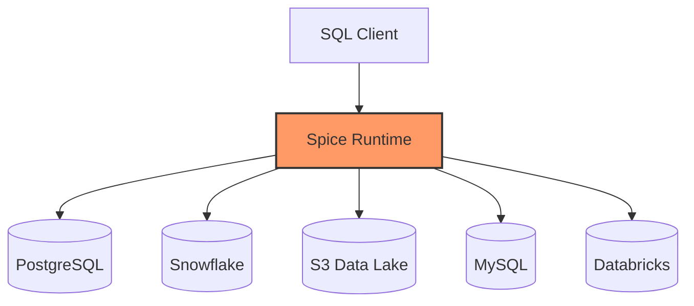
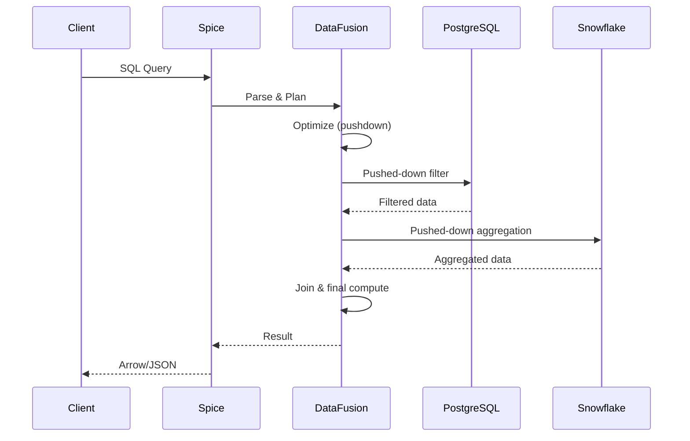
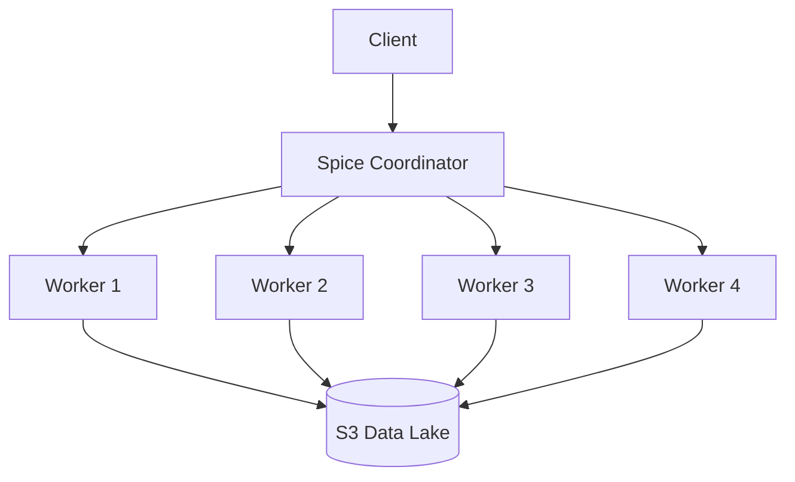

## What is Data Federation?

Data federation allows you to query data across multiple disparate sources using a single SQL interface, without moving or copying the data. Spice acts as a unified query layer that routes queries to the appropriate backend systems.



**Single Query, Multiple Sources:**

```sql
SELECT 
    o.order_id,
    c.customer_name,
    p.product_name
FROM postgres_orders o
JOIN snowflake_customers c ON o.customer_id = c.id
JOIN s3_products p ON o.product_id = p.id
WHERE o.order_date > '2024-01-01';
```

## How Federated Queries Work

### Query Execution Flow



### Query Push-Down Optimization

Spice intelligently pushes computations to the source systems:

**Filter Push-Down**

```sql
-- Your query
SELECT * FROM postgres_table WHERE status = 'active' AND created_at > '2024-01-01';

-- Spice pushes the WHERE clause to PostgreSQL
```

Only matching rows are transferred over the network.

**Projection Push-Down**

```sql
-- Your query
SELECT id, name FROM snowflake_table;

-- Spice only requests 'id' and 'name' columns from Snowflake
```

Reduces data transfer by selecting only needed columns.

**Aggregation Push-Down**

```sql
-- Your query
SELECT region, COUNT(*), SUM(amount) FROM duckdb_sales GROUP BY region;

-- Spice pushes GROUP BY to DuckDB when possible
```

Aggregations run in the source database, minimizing data movement.

## Supported Data Connectors

Spice supports 30+ data connectors across databases, warehouses, lakes, and files.

### Databases

| Connector | Status | Use Case |
|-----------|--------|----------|
| `postgres` | Stable | Transactional data, operational queries |
| `mysql` | Stable | Web applications, CMS systems |
| `mssql` | Beta | Enterprise SQL Server deployments |
| `oracle` | Alpha | Legacy enterprise systems |
| `clickhouse` | Alpha | Real-time analytics |
| `mongodb` | Alpha | Document databases |
| `scylladb` | Alpha | Wide-column NoSQL |
| `dynamodb` | Release Candidate | AWS key-value store |

### Data Warehouses

| Connector | Status | Use Case |
|-----------|--------|----------|
| `snowflake` | Beta | Cloud data warehouse |
| `databricks` | Beta/Stable | Lakehouse analytics |
| `dremio` | Stable | Data lakehouse |
| `spice.ai` | Stable | Spice Cloud Platform |

### Data Lakes & Files

| Connector | Status | Protocol |
|-----------|--------|----------|
| `s3` | Stable | Parquet, CSV from S3 |
| `delta_lake` | Stable | Delta Lake format |
| `iceberg` | Beta | Apache Iceberg tables |
| `file` | Stable | Local Parquet/CSV |
| `abfs` | Alpha | Azure Blob Storage |
| `gcs` | Alpha | Google Cloud Storage |
| `glue` | Alpha | AWS Glue Catalog |

### Other Sources

| Connector | Status | Use Case |
|-----------|--------|----------|
| `github` | Stable | GitHub issues, PRs, stargazers |
| `graphql` | Release Candidate | GraphQL APIs |
| `http`/`https` | Alpha | REST APIs returning Parquet/CSV/JSON |
| `kafka` | Alpha | Streaming data |
| `debezium` | Alpha | Change Data Capture (CDC) |

[View full connector list](/components/data-connectors)

## Configuring Federated Datasets

Define datasets in your `spicepod.yaml`:

```yaml spicepod.yaml
version: v2
kind: Spicepod
name: my_app

datasets:
  # PostgreSQL source
  - from: postgres:public.orders
    name: orders
    params:
      pg_host: localhost
      pg_port: 5432
      pg_db: mydb
      pg_user: ${secrets:pg_user}
      pg_pass: ${secrets:pg_pass}

  # Snowflake source
  - from: snowflake:analytics.customers
    name: customers
    params:
      snowflake_account: my_account
      snowflake_warehouse: compute_wh
      snowflake_database: analytics
      snowflake_username: ${secrets:sf_user}
      snowflake_password: ${secrets:sf_pass}

  # S3 Parquet files
  - from: s3://my-bucket/products/*.parquet
    name: products
    params:
      aws_region: us-east-1
      aws_access_key_id: ${secrets:aws_key}
      aws_secret_access_key: ${secrets:aws_secret}
```

### Using Secrets

Never hardcode credentials. Use secret references:

```yaml
params:
  pg_user: ${secrets:POSTGRES_USER}
  pg_pass: ${secrets:POSTGRES_PASSWORD}
```

Secrets can come from:

- Environment variables (`env` secret store, default)
- AWS Secrets Manager
- Azure Key Vault
- Kubernetes secrets
- HashiCorp Vault

## Federated Query Examples

### Cross-Database Join

```sql
-- Join PostgreSQL orders with Snowflake customers
SELECT 
    o.order_id,
    o.order_date,
    c.customer_name,
    c.email
FROM orders o
JOIN customers c ON o.customer_id = c.id
WHERE o.status = 'completed'
  AND o.order_date >= CURRENT_DATE - INTERVAL '30 days';
```

### Aggregating Across Sources

```sql
-- Aggregate data from multiple sources
SELECT 
    'PostgreSQL' as source,
    COUNT(*) as record_count,
    SUM(amount) as total_amount
FROM postgres_orders

UNION ALL

SELECT 
    'Snowflake' as source,
    COUNT(*) as record_count,
    SUM(amount) as total_amount
FROM snowflake_historical_orders;
```

### Querying S3 Data Lake

```sql
-- Query partitioned Parquet files in S3
SELECT 
    date_trunc('day', event_time) as day,
    event_type,
    COUNT(*) as event_count
FROM s3://analytics/events/year=2024/month=*/day=*/*.parquet
WHERE event_time >= '2024-01-01'
GROUP BY 1, 2
ORDER BY 1 DESC;
```

## Distributed Multi-Node Query

Scale federated queries across multiple nodes using Apache Ballista:

```yaml spicepod.yaml
runtime:
  distributed:
    enabled: true
    workers: 4
```

**Architecture:**



**Benefits:**

- Parallel data scanning across partitions
- Distributed aggregations
- Improved performance on large datasets (TB+)

## Performance Considerations

### When Federation Works Well

- **Selective queries** with strong filters
- **Pre-aggregated source data**
- **Small result sets** after filtering
- **Push-down compatible** operations

### When to Use Acceleration

Consider [data acceleration](/concepts/data-acceleration) when:

- Queries access the same data repeatedly
- Source queries are slow (seconds)
- Network latency is high
- Source systems have rate limits
- Low-latency queries required (&lt;100ms)

See [Data Acceleration](/concepts/data-acceleration) for materialization strategies.

## Catalog Connectors

Catalog connectors expose entire catalogs for federated query:

```yaml spicepod.yaml
catalogs:
  - from: unity_catalog
    name: databricks_catalog
    params:
      unity_catalog_url: https://my-workspace.cloud.databricks.com
      databricks_token: ${secrets:databricks_token}
```

All tables in the catalog become queryable:

```sql
SHOW TABLES FROM databricks_catalog.production;

SELECT * FROM databricks_catalog.production.sales;
```

**Supported Catalogs:**

| Catalog | Status | Description |
|---------|--------|-------------|
| `spice.ai` | Stable | Spice Cloud Platform |
| `unity_catalog` | Stable | Databricks Unity Catalog |
| `databricks` | Beta | Databricks Spark Connect |
| `iceberg` | Beta | Apache Iceberg REST Catalog |
| `glue` | Alpha | AWS Glue Data Catalog |

## Monitoring Federated Queries

Query performance metrics available via:

```sql
-- View recent query history
SELECT * FROM runtime.query_history 
ORDER BY start_time DESC 
LIMIT 10;

-- Check runtime metrics
SELECT * FROM runtime.metrics;
```

Metrics include:

- Query duration
- Rows scanned
- Data transferred
- Push-down effectiveness

## Best Practices

1. **Use specific filters**: Reduce data scanned at the source
2. **Select only needed columns**: Minimize network transfer
3. **Leverage push-down**: Let sources do the heavy lifting
4. **Monitor query plans**: Use `EXPLAIN` to verify push-down
5. **Consider acceleration**: For frequently accessed data
6. **Use secrets**: Never hardcode credentials
7. **Partition large datasets**: Enable predicate push-down on partitions

## Next Steps

<CardGroup cols={2}>
  <Card title="Data Acceleration" icon="gauge-high" href="/concepts/data-acceleration">
    Materialize federated data locally for faster queries
  </Card>
  <Card title="Data Connectors" icon="plug" href="/components/data-connectors">
    Browse all available data connectors
  </Card>
  <Card title="Spicepods" icon="cube" href="/concepts/spicepods">
    Learn Spicepod configuration format
  </Card>
  <Card title="Query Federation Guide" icon="book" href="/features/query-federation">
    Detailed federation feature guide
  </Card>
</CardGroup>