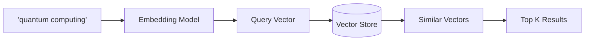
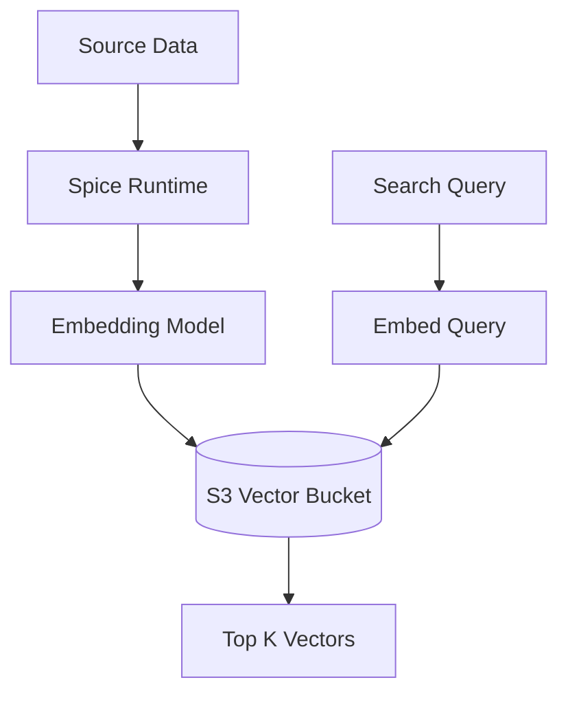
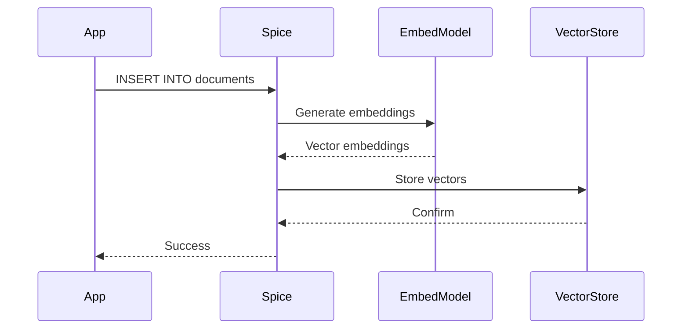

## Overview

Spice provides enterprise-grade search capabilities integrated directly into SQL queries:

- **Vector Search**: Similarity search using embeddings (semantic search)
- **Full-Text Search**: BM25 keyword search via Tantivy
- **Hybrid Search**: Combine vector and keyword search with Reciprocal Rank Fusion (RRF)

All search is SQL-integrated using table functions: `vector_search()` and `text_search()`.

## Search Capabilities

### Vector Search

Find similar items using semantic embeddings:

```sql
-- Find 10 most similar documents to a query
SELECT 
    doc_id,
    title,
    content,
    _score
FROM vector_search(
    documents,           -- table name
    'quantum computing', -- search query
    10                   -- limit
)
WHERE category = 'science'
ORDER BY _score DESC;
```

**How it works:**



### Full-Text Search

Keyword-based search with BM25 ranking:

```sql
-- Full-text search with keyword matching
SELECT 
    doc_id,
    title,
    snippet,
    _score
FROM text_search(
    documents,                    -- table name
    'artificial intelligence AI', -- keywords
    10                            -- limit
)
ORDER BY _score DESC;
```

**Powered by Tantivy:** High-performance full-text search engine written in Rust with BM25 ranking.

### Hybrid Search

Combine vector and keyword search using Reciprocal Rank Fusion (RRF):

```sql
-- Hybrid search: semantic + keyword
WITH vector_results AS (
    SELECT doc_id, _score as vector_score
    FROM vector_search(documents, 'machine learning', 20)
),
text_results AS (
    SELECT doc_id, _score as text_score
    FROM text_search(documents, 'machine learning ML', 20)
)
SELECT 
    d.doc_id,
    d.title,
    d.content,
    COALESCE(v.vector_score, 0) + COALESCE(t.text_score, 0) as combined_score
FROM documents d
LEFT JOIN vector_results v ON d.doc_id = v.doc_id
LEFT JOIN text_results t ON d.doc_id = t.doc_id
WHERE v.doc_id IS NOT NULL OR t.doc_id IS NOT NULL
ORDER BY combined_score DESC
LIMIT 10;
```

**Benefits of Hybrid Search:**

- Combines semantic understanding (vector) with exact keyword matching (text)
- More robust than either method alone
- Better handles queries with specific terminology

## Vector Stores

Spice supports multiple vector storage backends:

| Vector Store | Scale | Best For |
|--------------|-------|----------|
| `s3_vectors` | Petabyte-scale | Production, large-scale deployments |
| `pgvector` | GB to TB | PostgreSQL integration |
| `duckdb_vector` | GB | Local development, analytics |
| `sqlite_vec` | MB to GB | Embedded applications, edge |

### Amazon S3 Vectors (Production)

**Petabyte-scale vector search** with native S3 integration:

```yaml spicepod.yaml
datasets:
  - from: postgres:public.documents
    name: documents
    acceleration:
      enabled: true
      engine: duckdb
    columns:
      - name: content
        embeddings:
          - from: openai
            model: text-embedding-3-small
            row_ids:
              - doc_id
    vectors:
      store: s3_vectors
      params:
        s3_vectors_region: us-east-1
        s3_vectors_bucket: my-vector-bucket
        s3_vectors_access_key_id: ${secrets:aws_key}
        s3_vectors_secret_access_key: ${secrets:aws_secret}
```

**Architecture:**



**Features:**

- Managed vector lifecycle (ingest → embed → store → query)
- Automatic embedding generation
- Cosine similarity, Euclidean distance, dot product
- Metadata filtering
- Horizontal scaling

### pgvector

PostgreSQL extension for vector search:

```yaml
columns:
  - name: description
    embeddings:
      - from: openai
        model: text-embedding-3-small
vectors:
  store: pgvector
  params:
    pgvector_host: localhost
    pgvector_port: 5432
    pgvector_database: vectors
    pgvector_user: ${secrets:pg_user}
    pgvector_password: ${secrets:pg_pass}
```

**Best for:** Integrating with existing PostgreSQL infrastructure

### DuckDB Vector

Embedded vector search with DuckDB:

```yaml
vectors:
  store: duckdb_vector
  params:
    duckdb_vector_path: ./vectors.duckdb
```

**Best for:** Local development, analytics workloads

### SQLite Vec

Lightweight vector search:

```yaml
vectors:
  store: sqlite_vec
  params:
    sqlite_vec_path: ./vectors.db
```

**Best for:** Embedded applications, edge devices, small datasets

## Embedding Models

Generate vector embeddings from text:

### OpenAI Embeddings

```yaml
columns:
  - name: content
    embeddings:
      - from: openai
        model: text-embedding-3-small  # or text-embedding-3-large
        row_ids:
          - doc_id
        params:
          openai_api_key: ${secrets:openai_key}
```

**Models:**

- `text-embedding-3-small`: 1536 dimensions, fast, cost-effective
- `text-embedding-3-large`: 3072 dimensions, higher quality

### AWS Bedrock Embeddings

```yaml
columns:
  - name: content
    embeddings:
      - from: bedrock
        model: amazon.titan-embed-text-v1  # or cohere.embed-english-v3
        params:
          aws_region: us-east-1
          aws_access_key_id: ${secrets:aws_key}
          aws_secret_access_key: ${secrets:aws_secret}
```

**Models:**

- `amazon.titan-embed-text-v1`: 1536 dimensions
- `cohere.embed-english-v3`: 1024 dimensions

### HuggingFace Embeddings

Local or hosted HuggingFace models:

```yaml
columns:
  - name: content
    embeddings:
      - from: huggingface
        model: sentence-transformers/all-MiniLM-L6-v2
        params:
          huggingface_token: ${secrets:hf_token}  # Optional for public models
```

**Popular models:**

- `sentence-transformers/all-MiniLM-L6-v2`: 384 dimensions, fast
- `sentence-transformers/all-mpnet-base-v2`: 768 dimensions, high quality

### Model2Vec (Static Embeddings)

**500x faster** static embeddings:

```yaml
columns:
  - name: content
    embeddings:
      - from: model2vec
        model: minishlab/M2V_base_output
```

**Benefits:**

- No GPU required
- Extremely fast inference
- Good for high-throughput scenarios
- Lower quality than transformer models

### Local File-Based Models

```yaml
columns:
  - name: content
    embeddings:
      - from: file
        model: /path/to/model.onnx  # ONNX format
```

## Full-Text Search Configuration

Enable BM25 full-text search on columns:

```yaml spicepod.yaml
datasets:
  - from: postgres:public.articles
    name: articles
    acceleration:
      enabled: true
      engine: duckdb
    columns:
      - name: title
        full_text_search:
          enabled: true
          row_ids:
            - article_id
      - name: content
        full_text_search:
          enabled: true
          row_ids:
            - article_id
```

**Then query:**

```sql
SELECT * FROM text_search(articles, 'database query optimization', 20);
```

## Distance Metrics

Vector search supports multiple distance functions:

### Cosine Similarity (Default)

Measures angle between vectors (normalized):

```yaml
vectors:
  store: s3_vectors
  params:
    distance_metric: cosine  # Default
```

**Best for:** Most text embeddings, semantic search

### Euclidean Distance (L2)

Straight-line distance between vectors:

```yaml
vectors:
  params:
    distance_metric: euclidean
```

**Best for:** When magnitude matters

### Dot Product

Inner product of vectors:

```yaml
vectors:
  params:
    distance_metric: dot_product
```

**Best for:** Unnormalized embeddings, certain ML models

## Metadata Filtering

Combine vector search with SQL filters:

```sql
-- Vector search with WHERE clause
SELECT 
    product_id,
    name,
    description,
    _score
FROM vector_search(products, 'wireless headphones', 10)
WHERE 
    category = 'electronics'
    AND price < 200
    AND in_stock = true
ORDER BY _score DESC;
```

Filters are applied **after** vector search retrieval.

## Multi-Column Embeddings

Embed multiple columns:

```yaml
columns:
  - name: title
    embeddings:
      - from: openai
        model: text-embedding-3-small
        row_ids:
          - doc_id
  - name: content
    embeddings:
      - from: openai
        model: text-embedding-3-small
        row_ids:
          - doc_id
```

**Query searches all embedded columns:**

```sql
SELECT * FROM vector_search(documents, 'search term', 10);
-- Searches both title and content embeddings
```

## Composite Primary Keys

Use multiple columns as row identifiers:

```yaml
columns:
  - name: review_text
    embeddings:
      - from: openai
        model: text-embedding-3-small
        row_ids:
          - user_id
          - product_id  # Composite key
```

## Search Use Cases

### Semantic Search

```sql
-- Find conceptually similar documents
SELECT * FROM vector_search(
    knowledge_base,
    'How do I reset my password?',
    5
);
-- Returns documents about account recovery, login issues, etc.
```

### Recommendation Systems

```sql
-- Find similar products
WITH product_vector AS (
    SELECT embedding FROM products WHERE product_id = 12345
)
SELECT p.* FROM products p
CROSS JOIN product_vector pv
ORDER BY cosine_distance(p.embedding, pv.embedding)
LIMIT 10;
```

### Document Retrieval (RAG)

```sql
-- Retrieve context for LLM
SELECT 
    chunk_id,
    content,
    metadata,
    _score
FROM vector_search(
    document_chunks,
    'What is the return policy?',
    5
)
ORDER BY _score DESC;
```

See [AI Inference](/concepts/ai-inference) for LLM integration.

### Duplicate Detection

```sql
-- Find near-duplicate content
SELECT 
    a.doc_id as original,
    b.doc_id as duplicate,
    similarity_score
FROM documents a
JOIN LATERAL (
    SELECT doc_id, _score as similarity_score
    FROM vector_search(documents, a.content, 5)
    WHERE doc_id != a.doc_id
) b ON true
WHERE b.similarity_score > 0.95;
```

## Performance Considerations

### Indexing

Vector stores use approximate nearest neighbor (ANN) indexes:

- **HNSW** (Hierarchical Navigable Small World): Default for most stores
- **IVF** (Inverted File Index): For very large datasets

### Embedding Generation

Embedding happens automatically on insert/update:



### Query Performance

Typical latencies:

| Operation | Latency |
|-----------|--------|
| Embedding generation (OpenAI) | 50-200ms |
| Vector search (S3 Vectors) | 10-100ms |
| Vector search (pgvector) | 5-50ms |
| Vector search (local) | 1-10ms |
| Full-text search (Tantivy) | 1-20ms |

## Search Best Practices

1. **Choose appropriate embedding model**: Balance quality vs. speed vs. cost
2. **Use hybrid search**: Combine vector + keyword for best results
3. **Filter after retrieval**: Apply WHERE clauses on vector_search results
4. **Batch embeddings**: Generate embeddings in bulk when possible
5. **Monitor vector store size**: Large stores need more compute
6. **Use composite keys**: For complex join scenarios
7. **Test distance metrics**: Try cosine, euclidean, dot product for your use case
8. **Enable full-text search**: For exact keyword matching

## Example: E-Commerce Search

```yaml spicepod.yaml
datasets:
  - from: postgres:public.products
    name: products
    acceleration:
      enabled: true
      engine: duckdb
    columns:
      - name: name
        full_text_search:
          enabled: true
          row_ids:
            - product_id
      - name: description
        embeddings:
          - from: openai
            model: text-embedding-3-small
            row_ids:
              - product_id
        full_text_search:
          enabled: true
          row_ids:
            - product_id
    vectors:
      store: s3_vectors
      params:
        s3_vectors_region: us-east-1
        s3_vectors_bucket: product-vectors
```

**Query:**

```sql
-- Hybrid product search
WITH semantic AS (
    SELECT product_id, _score as semantic_score
    FROM vector_search(products, 'comfortable wireless headphones', 50)
),
keyword AS (
    SELECT product_id, _score as keyword_score
    FROM text_search(products, 'wireless headphones bluetooth', 50)
)
SELECT 
    p.product_id,
    p.name,
    p.price,
    p.rating,
    COALESCE(s.semantic_score, 0) * 0.6 + COALESCE(k.keyword_score, 0) * 0.4 as final_score
FROM products p
LEFT JOIN semantic s ON p.product_id = s.product_id
LEFT JOIN keyword k ON p.product_id = k.product_id
WHERE 
    (s.product_id IS NOT NULL OR k.product_id IS NOT NULL)
    AND p.in_stock = true
    AND p.price < 300
ORDER BY final_score DESC
LIMIT 20;
```

## Next Steps

<CardGroup cols={2}>
  <Card title="AI Inference" icon="brain" href="/concepts/ai-inference">
    Use search results for RAG and LLM context
  </Card>
  <Card title="Embeddings" icon="vector-square" href="/ai/embeddings">
    Detailed embedding model configurations
  </Card>
  <Card title="Vector Stores" icon="database" href="/search/overview">
    Vector store setup and tuning
  </Card>
  <Card title="Amazon S3 Vectors" icon="aws" href="/vectors/s3">
    Petabyte-scale vector search guide
  </Card>
</CardGroup>